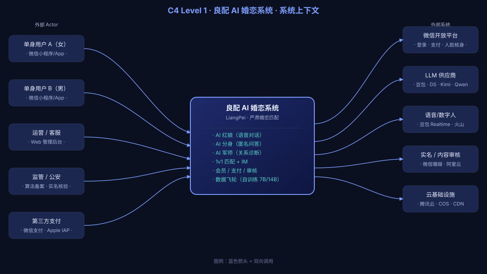

# 01 · C4 Level 1 — 系统上下文

## 范围

本文描述「良配复刻」系统与外部 actor / 外部系统的边界关系。系统**内部**的拆分见 [02-containers.md](./02-containers.md)。

## 图

完整 SVG 源码：[`./diagrams/c4-context.svg`](./diagrams/c4-context.svg)。

## 元素清单

### 外部 Actor

| 名称 | 描述 | 接入方式 |
|---|---|---|
| 单身用户 A | 客户端主体（女），需要被严肃匹配 | 微信小程序 / iOS App / Android App |
| 单身用户 B | 客户端主体（男），需要被严肃匹配 | 同上 |
| 运营 / 客服 | 后台用户，处理投诉、查封、查数据 | Web 管理后台（Vben / Nuxt） |
| 监管 / 公安 | 合规接口调用方（算法备案、实名核验） | 监管接口、腾讯云人脸核身 |

### 外部系统

| 名称 | 用途 | 关键接口 |
|---|---|---|
| 微信开放平台 | 登录、支付、人脸核身、订阅消息 | `wx.login` / V3 支付 / `startFacialRecognitionVerify` |
| LLM 供应商 | AI 红娘 / 分身 / 军师对话 | DeepSeek-V3、Qwen3、豆包、Kimi |
| 语音 / 数字人 | Realtime 语音、数字人形象 | 豆包 Realtime、火山数字人 |
| 实名 / 内容审核 | 实名核验、内容审核 | 微信珊瑚、阿里云内容安全 |
| 云基础设施 | 主机、对象存储、CDN | 腾讯云、COS、CDN |

### 核心系统：「良配 AI 婚恋系统」

包含以下子能力（详见 [03-components-ai.md](./03-components-ai.md)）：

- **AI 红娘**：注册期 20 分钟语音对话 → 结构化抽取 → 资料画像
- **AI 分身**：运行时匿名问答，化解敏感问题（彩礼/房贷/家庭）
- **AI 军师**：运行时关系诊断、破冰话术、心有灵犀彩蛋
- **1v1 匹配 + IM**：滑卡 + 单聊，**同时只能与一人匹配**
- **会员 / 支付 / 审核**：连续订阅 + 多通道支付 + 全场景内容审核
- **数据飞轮**：训练中的 7B / 14B 后训练模型，输入双方资料输出"成功率"

## 关键调用关系

| From | To | 模式 | 说明 |
|---|---|---|---|
| 用户 | 核心系统 | HTTPS / WebSocket | 小程序/App 调用 BFF；IM 走长连接 |
| 核心系统 | 微信开放平台 | HTTPS | 登录态换取、支付下单 |
| 核心系统 | LLM 供应商 | HTTPS（流式） | SSE 流式对话，多供应商 fallback |
| 核心系统 | 语音/数字人 | WebSocket | Realtime 双向音频流 |
| 核心系统 | 实名/审核 | HTTPS | 同步调用，RT < 200ms |

## 系统边界外（**不**在本仓库实现）

- 微信开放平台本身
- 各 LLM / 数字人供应商本身
- 监管平台（我们是被监管方）
- 第三方支付通道本身

## 后续阅读

- 内部架构拆分 → [02-containers.md](./02-containers.md)
- AI 域详细组件 → [03-components-ai.md](./03-components-ai.md)
- 部署拓扑 → [04-deployment.md](./04-deployment.md)