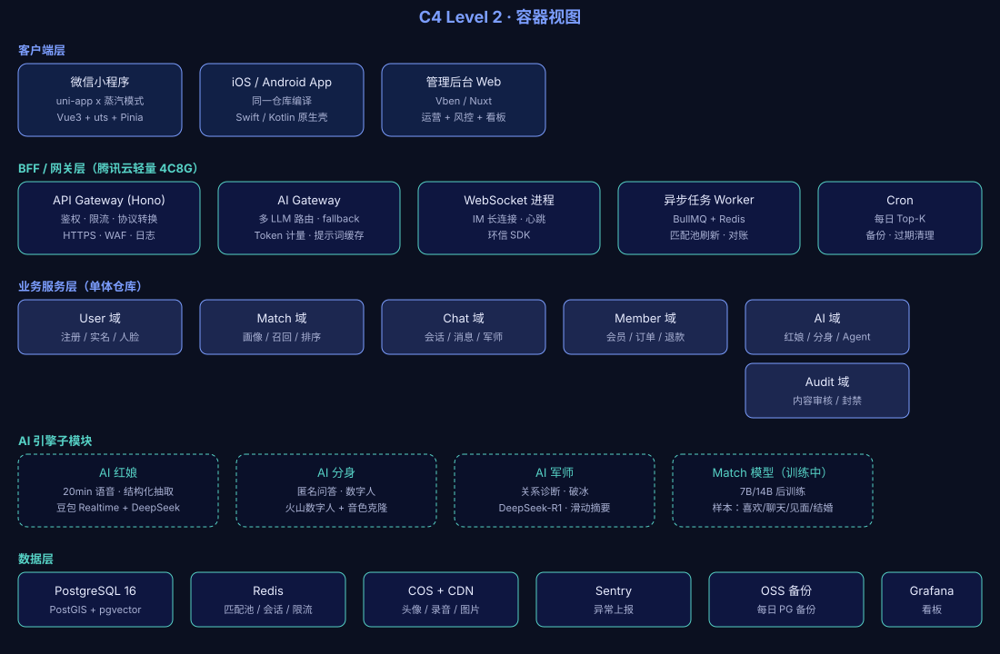

# 02 · C4 Level 2 — 容器视图

## 范围

本文描述「良配复刻」系统内部的容器（应用 / 服务 / 数据存储）拆分。容器之间的**关系**用文字 + 图描述，**理由**见对应的 ADR。

## 图

## 容器清单

### 客户端层

| 容器 | 技术 | 仓库形态 |
|---|---|---|
| 微信小程序 | uni-app x 蒸汽模式（Vue3 + uts） | 同一仓库 `app/` |
| iOS / Android App | uni-app x 编译出包（Swift / Kotlin 原生壳） | 同一仓库，CI 出包 |
| 管理后台 Web | Vben / Nuxt | `admin/` 子包 |

### BFF / 网关层

部署在 **腾讯云轻量 4C8G**（约 ¥120/月）。

| 容器 | 职责 | 备注 |
|---|---|---|
| API Gateway (Hono) | 鉴权、限流、协议转换、HTTPS、WAF、日志 | 单仓库多实例 |
| AI Gateway | 多 LLM 路由、fallback、Token 计量、Prompt 缓存 | 与 API Gateway 同进程可独立扩 |
| WebSocket 进程 | IM 长连接、心跳、消息推送 | **独立部署**，便于扩展 |
| 异步任务 Worker | BullMQ + Redis（匹配池刷新、对账、邮件） | — |
| Cron / Scheduler | 每日 Top-K 计算、备份、过期清理 | — |

### 业务服务层（单体仓库，模块化拆分）

| 域 | 职责 | 关键依赖 |
|---|---|---|
| **User 域** | 注册 / 实名 / 人脸 / 未婚 | 微信开放平台、PG |
| **Match 域** | 画像 / 召回 / 排序 / 1v1 锁 | PG、pgvector、Redis、Worker |
| **Chat 域** | 会话 / 消息 / AI 军师 | 环信 IM、DeepSeek-R1 |
| **Member 域** | 会员 / 订单 / 退款 | 微信支付、Apple IAP、Google Play |
| **AI 域** | 红娘 / 分身 / Agent | DeepSeek-V3、豆包 Realtime、火山 |
| **Audit 域** | 内容审核 / 封禁 | 微信珊瑚、阿里云 |

### AI 引擎子模块（AI 域内部）

| 子模块 | 用途 | 模型组合 |
|---|---|---|
| AI 红娘 (Matchmaker Agent) | 注册期 20min 语音对话 + 结构化抽取 | 豆包 Realtime + DeepSeek-V3 + Qwen |
| AI 分身 (Avatar Agent) | 运行时匿名问答 + 数字人形象 | 火山数字人 + 音色克隆 |
| AI 军师 (Advisor Agent) | 运行时关系诊断 + 破冰话术 | DeepSeek-R1 + 滑动窗口摘要 |
| Match 模型（训练中） | 后训练 7B/14B · 成功预测 | 自托管 vLLM（未来） |

### 数据层

| 容器 | 技术 | 月成本 |
|---|---|---|
| OLTP | PostgreSQL 16（PostGIS + pgvector + JSONB） | ¥220/月（2C4G） |
| 缓存 | 腾讯云 Redis 标准版 1G | ¥30/月 |
| 对象存储 + CDN | 腾讯云 COS + CDN | ¥30/月（百 GB 量级） |
| 备份 | OSS 跨地域复制 | ¥20/月 |
| 监控 | Sentry 免费版 + 阿里云日志 | ¥0–50/月 |
| 看板 | Grafana + Prometheus | ¥0（开源自托管） |

## 关键调用关系

| From | To | 协议 | 备注 |
|---|---|---|---|
| 客户端 → API Gateway | HTTPS | 主流量 |
| 客户端 → WebSocket | WSS | IM 长连接 |
| API Gateway → 业务服务 | 内部 RPC（函数调用） | 单体仓库 |
| AI Gateway → LLM 供应商 | HTTPS（SSE） | 流式对话 |
| WebSocket → 环信 | HTTPS / TCP | SDK 封装 |
| Worker → 业务服务 | 内部调用 | 同仓库 |
| 业务服务 → PG | TCP（5432） | PgBouncer 池化 |
| 业务服务 → Redis | TCP（6379） | 连接池 |

## 部署策略

- **客户端**：uni-app x 一码多端，CI 出 4 个产物（微信小程序、iOS、Android、H5）
- **BFF**：单进程多实例（Nginx upstream），水平扩展
- **业务服务**：与 BFF 同进程（单体起步），DAU > 5 万时按域拆服务
- **Worker**：BullMQ 标准部署，按队列分进程
- **数据**：PG 主备 + Redis 主从（同城双可用区）

## 后续阅读

- AI 域组件级 → [03-components-ai.md](./03-components-ai.md)
- 部署拓扑与灾备 → [04-deployment.md](./04-deployment.md)
- 决策理由 → [ADR 索引](../adr/)