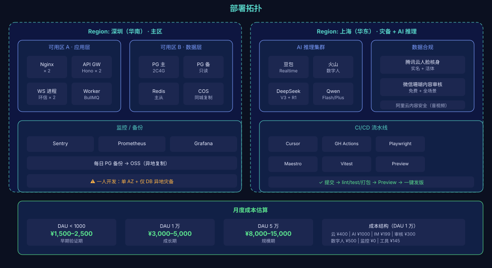

# 04 · 部署拓扑

## 范围

物理/逻辑部署视图：地域、可用区、网络边界、数据合规、灾备策略。

## 图

## 地域划分

| 地域 | 角色 | 主要服务 |
|---|---|---|
| **深圳（华南）** | 主区 | 主站点、数据库主备、对象存储、COS |
| **上海（华东）** | 灾备 + AI 推理 | AI 推理集群、人脸核身、内容审核接口 |

**为什么这样分？**
- 小程序用户华南占比高，深圳主区降低首屏延迟
- LLM 供应商多部署在华东/北京，AI 推理放在上海减少跨网延迟
- 灾备异地（上海）应对深圳可用区整体故障

## 可用区拓扑（深圳主区）

### 可用区 A · 应用层

| 实例 | 规格 | 数量 | 月成本 |
|---|---|---|---|
| Nginx + API Gateway (Hono) | 4C8G | 2 | ¥240 |
| WebSocket 进程（环信 SDK） | 4C8G | 2 | ¥240 |
| Worker (BullMQ) | 4C8G | 1 | ¥120 |

### 可用区 B · 数据层

| 实例 | 规格 | 数量 | 月成本 |
|---|---|---|---|
| PostgreSQL 主 | 2C4G | 1 | ¥220 |
| PostgreSQL 备（只读） | 2C4G | 1 | ¥110 |
| Redis 主从 | 1G | 2 | ¥60 |
| COS（对象存储） | — | — | ¥30 + 流量 |

## 上海灾备 + AI 集群

### AI 推理集群

| 服务 | 用途 | 模型 |
|---|---|---|
| 豆包 Realtime | 语音 ASR/TTS Realtime | 字节豆包 |
| 火山数字人 | 数字人形象 | 字节火山 |
| DeepSeek V3 + R1 | 主对话 + 推理 | DeepSeek |
| Qwen Flash / Plus | 兜底 + Embedding | 阿里通义 |

### 数据合规服务

| 服务 | 用途 | 备注 |
|---|---|---|
| 腾讯云人脸核身 | 实名 + 活体 | ¥0.8/次 |
| 微信珊瑚内容审核 | 免费 + 全场景 | 必须启用 |
| 阿里云内容安全 | 音视频流兜底 | ¥1.2/万次起 |

## 灾备策略

| 数据 | 备份方式 | 恢复 RTO | 恢复 RPO |
|---|---|---|---|
| PostgreSQL | 每日逻辑备份 → OSS（跨地域复制） | < 1h | < 24h |
| Redis | 主从复制（同步） | < 5min | < 1s |
| 对象存储 COS | 同城复制 + 异地复制 | < 30min | < 5min |
| Git 仓库 | 双备份（Gitee + GitHub） | 即时 | 即时 |

**一人开发强建议**：主区单可用区足够（避免双倍成本），灾备只备份 DB 不跑热备。

## 监控 + CI/CD

| 模块 | 工具 |
|---|---|
| 异常监控 | Sentry（前端 + 后端） |
| 指标 | Prometheus |
| 看板 | Grafana |
| CI/CD | GitHub Actions → Playwright + Maestro + Vitest |
| Preview 环境 | 自动部署 + 一键发版 |

## 告警阈值（关键）

| 指标 | 阈值 |
|---|---|
| API 错误率 | > 5% |
| LLM P95 延迟 | > 3s |
| PG 主从延迟 | > 2s |
| Redis 命中率 | < 80% |
| IM 在线人数跌幅 | > 30% |
| 支付回调 5min 未到 | 立即告警 |
| 越狱拦截数 | > 10/小时 |

## 数据合规边界

| 限制 | 要求 |
|---|---|
| **数据出境** | 服务器必须境内，禁用海外节点（含海外 LLM） |
| **未成年人保护** | 22 岁以下用户不参与匹配（注册时强制） |
| **实名核验** | 婚恋类目必办（个保法） |
| **等保备案** | 收集身份证/生物特征需等保 2.0 二级以上 |
| **算法备案** | AI 推荐/匹配属"算法服务"，需国家网信办备案 |
| **深度合成备案** | AI 数字人/音色合成需备案 |

## 上线 Checklist

- [ ] 注册公司主体 / 个体工商户
- [ ] 域名 ICP 备案 + 公安网安备案
- [ ] 微信小程序备案（5–7 工作日）
- [ ] 婚介类目资质（增值电信业务许可证 或 挂靠）
- [ ] 等保 2.0 备案
- [ ] 算法备案（提前 30 天排队）
- [ ] 深度合成备案
- [ ] 微信支付商户号申请
- [ ] Apple 开发者账号 + Google Play 开发者账号
- [ ] 域名 SSL 证书（Let's Encrypt 自动续）

## 后续阅读

- 整体架构 → [01-system-context.md](./01-system-context.md)
- 容器视图 → [02-containers.md](./02-containers.md)
- 故障 Runbook → [../runbook/failure-top10.md](../runbook/failure-top10.md)