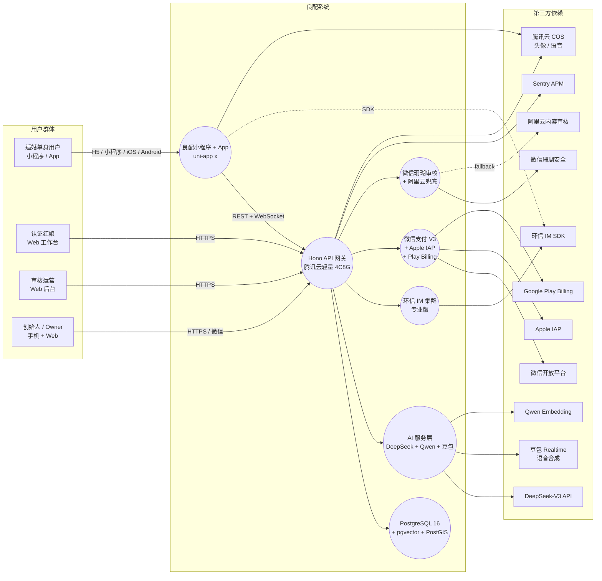

# 01 · System Context（C4 Level 1）

> 良配复刻项目的「外部视角」——谁在用、系统对外暴露什么接口、依赖哪些第三方。

---

## 1.1 系统全景图（Mermaid）

---

## 1.2 角色与诉求

| 角色 | 入口 | 关键诉求 | 系统应答 |
|---|---|---|---|
| 适婚单身用户 | 小程序 / App | 高质量匹配、AI 红娘陪我聊、不被骚扰 | 资料评分门槛、AI 红娘 7×24、严格审核 |
| 认证红娘 | Web 工作台 | 看到候选池、AI 辅助撮合、统计 KPI | 红娘面板 + AI 助手 + 数据看板 |
| 审核运营 | Web 后台 | 快速处置违规、批量打回、看趋势 | 审核队列 + 申诉流 + 仪表盘 |
| 创始人 / Owner | 移动端 + Web | 实时看核心指标、人工干预异常用户 | Owner 看板 + 紧急干预接口 |

---

## 1.3 系统对外契约（黑盒接口）

### 用户端（小程序 / App）

| 接口形态 | 用途 | 协议 |
|---|---|---|
| 匹配列表 / 滑卡 | 每日推荐 | HTTPS GET `/v1/match/feed` |
| IM 消息收发 | 1v1 私聊 | 环信 WebSocket SDK |
| AI 红娘对话 | 语音 + 文字 | HTTPS WebSocket `/v1/ai/hongniang/stream` |
| AI 分身问答 | 匿名投递 | HTTPS POST `/v1/ai/avatar/qna` |
| 支付下单 | 会员 / 单项服务 | HTTPS POST `/v1/pay/order` |
| 资料提交 | 注册 / 补全 | HTTPS POST `/v1/profile` |

### 内部管理端

| 接口形态 | 用途 |
|---|---|
| 红娘工作台 | 候选浏览、人工匹配、AI 撮合建议 |
| 审核后台 | 队列、申诉、规则配置、模型打分复核 |
| Owner 看板 | DAU、付费率、AI 调用成本、事故告警 |

---

## 1.4 关键外部依赖 SLA（最低可接受）

| 供应商 | 用途 | SLA 要求 | 降级方案 |
|---|---|---|---|
| DeepSeek-V3 | AI 红娘 / 分身 / 军师主对话 | 99.5%，P95 < 3s | → 豆包 → Qwen |
| 豆包 Realtime | 语音合成 | 99%，首响 < 1.5s | → 本地 TTS fallback |
| 环信 IM | 私聊消息 | 99.9%，送达 < 1s | 仅记账、延迟推送 |
| 微信支付 V3 | 会员支付 | 99.99%（微信保障） | Apple IAP 兜底 |
| 微信珊瑚 | 文本 / 图片审核 | 99.5% | 阿里云内容安全 |
| 腾讯云 COS | 头像 / 语音 | 99.9% | OSS 双写 |

---

## 1.5 系统边界原则

1. **小程序 / App 不直连任何第三方 AI/支付** —— 全部走自家 API 网关，便于审计、限流、降级。
2. **环信 IM 客户端 SDK 直连** —— 这是行业惯例，APP 端走 SDK 比走网关再转发延迟更低、成本更省。
3. **审核链路是同步阻塞** —— 内容进系统前必须过审，「先发后审」仅用于 IM 私聊场景。
4. **支付链路强一致** —— 任何金额变动都依赖微信 / Apple 的异步回调作为最终事实源，本地状态机只做缓存。