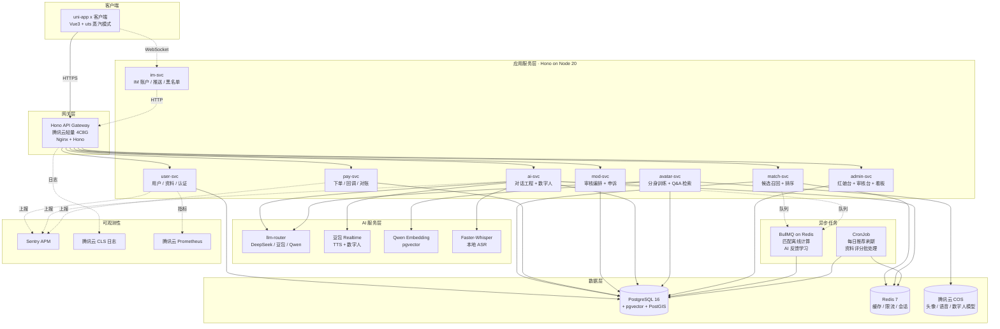

# 02 · Containers（C4 Level 2）

> 系统内部容器视图——后端服务如何拆分、技术栈选型、谁调用谁。

---

## 2.1 容器图



---

## 2.2 服务拆分原则

| 原则 | 含义 |
|---|---|
| 按业务能力拆分 | 一个 svc 对应一个 bounded context，不按技术层 |
| 独立部署 | 每个 svc 独立进程、独立 HMR，便于一人多栈下定位问题 |
| 共享数据库 | PostgreSQL 单一主库，按 schema 隔离，避免分布式事务 |
| 同步优先 | 用户链路用同步 HTTP + Redis 缓存，异步仅用于离线计算 |
| 单仓库 monorepo | pnpm workspace + Turborepo，CI 增量构建 |

---

## 2.3 共享库 / 平台层

| 名称 | 用途 | 技术 |
|---|---|---|
| `@liangpei/contracts` | API DTO + 协议定义，前后端共用 | TypeScript + Zod |
| `@liangpei/db` | Drizzle ORM schema + 迁移 | Drizzle Kit |
| `@liangpei/logger` | 结构化日志（pino + CLS） | TypeScript |
| `@liangpei/errors` | 统一错误码 + 用户文案映射 | TypeScript |
| `@liangpei/auth` | JWT 签发 + 微信 code2session 封装 | TypeScript |
| `@liangpei/llm` | 多供应商路由 + token 计数 + 限流 | TypeScript |
| `@liangpei/pay` | 微信 V3 / Apple IAP / Play Billing 适配 | TypeScript |

---

## 2.4 部署形态（单可用区，DAU 5 万内）

```
腾讯云轻量应用服务器 4C8G × 2
 ├─ Nginx + Hono Gateway（主）
 └─ Hono App（user/match/im/pay/mod/ai/admin）

腾讯云 PostgreSQL 16（4C16G 1 主 1 备）
Redis 7（2C4G）
腾讯云 COS（头像 / 语音 / 数字人）
腾讯云 CLS（日志） + Prometheus（指标）
Sentry.io（APM + 告警）
```

> **DAU 突破 5 万后** 拆分为多可用区 + K8s；当前架构只做单区是因为婚恋类目 DAU 在 6 个月内通常爬不到 5 万，过早分布式是过度工程。

---

## 2.5 服务间调用矩阵

| 调用方 ↓ \ 被调方 → | user | match | im | pay | mod | ai | avatar | admin |
|---|---|---|---|---|---|---|---|---|
| user | — | R | R | — | R | R | R | — |
| match | R | — | — | — | R | R | — | — |
| im | R | — | — | — | R | — | — | — |
| pay | R | — | — | — | — | — | — | — |
| mod | R | — | R | — | — | — | — | — |
| ai | R | R | — | — | R | — | R | — |
| avatar | R | — | — | — | R | R | — | — |
| admin | R | R | R | R | R | R | R | — |

> R = 同步 HTTP 调用；其余场景为空。所有跨服务调用都走 OpenTelemetry traceparent，方便 Sentry 看链路。