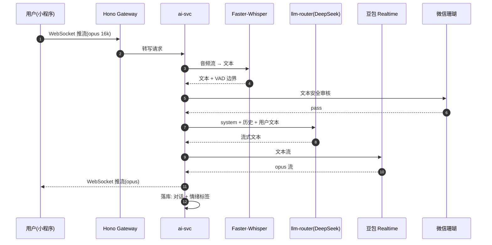
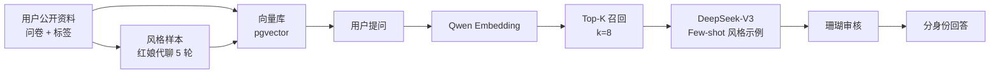
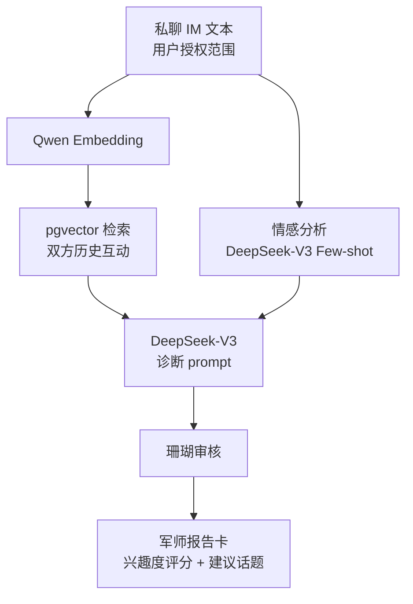
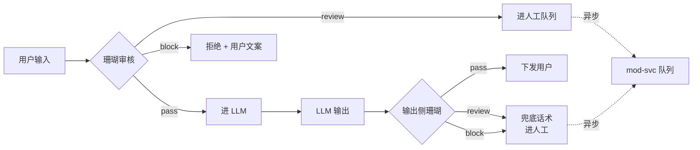

# 03 · AI 组件（红娘 / 分身 / 军师）

> 良配三大 AI 能力的内部机理——从用户提问到流式回复的完整链路。

---

## 3.1 AI 红娘 —— 7×24 语音情感对话

### 用户故事

> 用户从「匹配卡」点不开、不知道聊什么，进入 AI 红娘房间，红娘用温暖女声聊 5 分钟，引导用户完善资料、给出当日匹配解读。

### 时序图



### Prompt 分层

| 层 | 内容 | 注入方式 |
|---|---|---|
| 系统层 | 红娘人格 + 严肃婚恋边界 + 不替用户决策 | 每次必注入 |
| 情景层 | 当前用户资料 + 历史话题 + 情绪曲线 | 每轮注入 |
| 短期记忆 | 最近 8 轮对话原文 | 滑动窗口 |
| 长期记忆 | 用户关键事件（告白/被拒/重要日期） | pgvector 召回 top-3 |

### 成本控制

| 手段 | 数值 |
|---|---|
| 平均轮次 | 12 轮/会话 |
| 输入 token | 1800 / 轮 |
| 输出 token | 280 / 轮 |
| 单会话成本 | ¥0.16 |
| 每月预算（DAU 1 万，渗透率 8%） | ≈ ¥960 |
| 每日封顶 | 单用户 60 分钟，防沉迷 |

---

## 3.2 AI 分身 —— 匿名问答

### 用户故事

> 用户 A 想了解候选人 B 的婚恋观 / 性格，但不想直接问。建立 B 的「AI 分身」，向其分身提问 3 次，决定是否真聊。

### 训练链路



### 关键约束

| 约束 | 实现 |
|---|---|
| 训练数据最小化 | 仅用用户授权公开的资料 + 红娘代聊样本，**不**用 IM 私聊原文 |
| 风格锁定 | 系统提示词嵌入用户填写的「说话风格 8 题」 |
| 反滥用 | 单用户每日最多被提问 50 次；提问方也只能问 10 次 |
| 可撤回 | 用户随时一键删除分身（同时删除向量库 + 风格样本） |
| 合成水印 | TTS 输出嵌入音频水印（豆包支持） |

---

## 3.3 AI 军师 —— 关系诊断

### 用户故事

> 双方在 IM 私聊 30 条以上，用户 A 找 AI 军师分析「对方对我兴趣度」「下一步建议话题」。

### 流程



### 输出形式

- **兴趣度评分**：0–100，三档（高/中/低）
- **下一步建议**：3 条具体话题/动作
- **风险提示**：若对方冷暴力/情绪异常，给出是否继续建议
- **明确边界**：军师**不替用户做决策**，输出永远带"这只是分析，决定权在你"

---

## 3.4 多 LLM 路由策略

```
DeepSeek-V3 (主)
  ├─ 失败重试 1 次 → 豆包 Pro
  │                  ├─ 失败 → Qwen-Max
  │                                  └─ 失败 → 兜底话术 + 人工工单
  └─ P95 > 4s 自动切下一家
```

| 触发条件 | 动作 |
|---|---|
| HTTP 5xx | 重试 1 次，间隔 200ms |
| HTTP 429 | 立即切下一家，记入 Sentry breadcrumb |
| P95 超 4s（5 分钟窗口） | 切换主供应商，发飞书告警 |
| 输出含敏感词 | 拦截 + 走兜底话术 + 记入审核队列 |

---

## 3.5 内容安全的三道闸



- **输入侧**：微信珊瑚 + 阿里云双通道（任一拒绝即拒）
- **输出侧**：模型输出再过一次珊瑚（防 prompt injection 反射）
- **兜底话术**：预设 5 条温和拒答，避免冷场