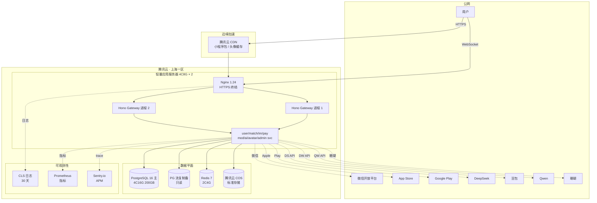

# 04 · Deployment（部署 / 灾备 / 监控）

> 单可用区 + 轻量部署形态，DAU 5 万内够用；超过则升级到多可用区 K8s。

---

## 4.1 部署架构图

---

## 4.2 容量规划

| 指标 | DAU 1 万 | DAU 5 万 |
|---|---|---|
| 应用服务器 | 4C8G × 2 | 8C16G × 4 + SLB |
| PostgreSQL | 4C16G 200GB | 8C32G 500GB + PgBouncer |
| Redis | 2C4G | 4C8G 集群 |
| AI 调用峰值 | 200 QPS | 1000 QPS |
| IM 并发连接 | 1 万 | 5 万 |
| 月度运营成本 | ¥1,500–2,500 | ¥8,000–15,000 |

---

## 4.3 灾备策略

| 场景 | RPO | RTO | 措施 |
|---|---|---|---|
| 单机宕机 | 0 | < 30s | Nginx upstream 健康检查，秒级切备机 |
| 数据库主库故障 | < 30s | < 2min | Patroni 自动 failover 到备库 |
| 整个可用区不可用 | < 5min | < 1h | 手动切到广州二区（提前演练） |
| 第三方 AI 全挂 | 0 | < 5min | 多供应商 fallback + 兜底话术 |
| 对象存储桶误删 | < 1h | < 24h | COS 跨桶复制 + 异地备份 |

### 备份策略

- **PG 物理备份**：每日 03:00 `pg_basebackup` 到 COS，归档保留 30 天
- **PG 逻辑备份**：每 6 小时 `pg_dump schema-only` 用于版本回滚
- **Redis**：AOF + 每日 RDB
- **COS**：跨桶复制到 `liangpei-backup-` 前缀桶，跨可用区

---

## 4.4 升级与回滚

| 部署方式 | 触发 | 回滚 |
|---|---|---|
| 应用服务 | PM2 reload（零停机） | `pm2 revert` 到上一版本 |
| 数据库迁移 | `drizzle-kit migrate` 双向迁移 | `drizzle-kit migrate --to <hash>` |
| 前端小程序 | 微信后台灰度（1% → 100%） | 上一版本仍可访问，回退审核版本 |
| iOS / Android | App Store / Play 灰度发布 | 已发布版本无法回退，必须热修复 |

> **一人开发约束**：每周一次大版本上线，避免频繁发布；紧急修复走 hotfix 分支 + 立即发版。

---

## 4.5 监控告警阈值

| 指标 | 警告 | 严重（触发 PagerDuty） |
|---|---|---|
| API P95 延迟 | > 800ms | > 1500ms 持续 5min |
| API 错误率 5xx | > 0.5% | > 2% 持续 3min |
| DB 连接数 | > 70% | > 90% |
| DB 复制延迟 | > 10s | > 60s |
| AI 调用 P95 | > 4s | > 8s 持续 5min |
| AI 调用失败率 | > 2% | > 5% |
| 审核队列堆积 | > 100 | > 500 |
| 支付回调失败 | > 3 笔 | > 10 笔 |

告警渠道：飞书机器人 → 短信 → 电话（仅严重级）。

---

## 4.6 域名 / SSL / 小程序后台

| 资源 | 用途 |
|---|---|
| `api.liangpei.app` | API 网关 |
| `cdn.liangpei.app` | 静态资源 |
| `admin.liangpei.app` | 红娘 / 审核后台 |
| 小程序 AppID | 微信开放平台申请 |
| 公众号关联 | 用于模板消息推送 |

SSL 用 Let's Encrypt 自动化续期，Certbot + Nginx reload。

---

## 4.7 升级路径（DAU 突破 5 万）

1. **Step 1**：单可用区 → 双可用区（同城）
2. **Step 2**：轻量服务器 → CVM + TKE（K8s）
3. **Step 3**：单库 → 读写分离 + 分库分表（按 user_id 哈希）
4. **Step 4**：Redis 单点 → Redis Cluster
5. **Step 5**：AI 服务独立部署 + GPU 节点（如果本地化 Whisper/TTS）

每一步都预留 50% 余量再升下一档，不做激进扩容。