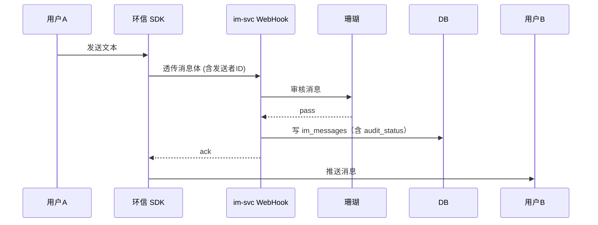

# 模块 · IM 即时通讯

> 1v1 私聊——基于环信专业版 SDK，前端直连，必要时服务端介入。

---

## 1. 功能范围

| 子能力 | 描述 |
|---|---|
| 1v1 文本消息 | 含 emoji / 表情包 |
| 语音消息 | 60s 上限，opus 编码 |
| 图片消息 | COS 上传 + 珊瑚审核 |
| 消息已读 | 双向已读回执 |
| 消息撤回 | 2 分钟内 |
| 拉黑 / 举报 | 触发即终止会话 |
| 离线推送 | 极光推送（小程序 + App 通用） |
| 敏感词拦截 | 服务端二次审核（客户端兜底） |

---

## 2. 为什么选环信（核心 ADR-003）

| 方案 | 成本（DAU 1 万） | 交付周期 | 消息送达 |
|---|---|---|---|
| 环信专业版 | **¥0（前 100 DAU 免费）**，超出约 ¥1,500/月 | 1 周 | P99 < 1s |
| 自建 WebSocket + MongoDB | 服务器 ¥800/月 + 开发 2 人月 | 8 周 | 经常丢消息 |
| 腾讯云 IM | ¥1,800/月 | 1 周 | P99 < 1s |

**结论：环信赢在「专业版免费 + SDK 稳定 + 婚恋类案例多」**。自建是 ADR-006 的反例，已拒绝。

---

## 3. 关键流程

### 匹配成功 → 创建会话

```mermaid
sequenceDiagram
  participant MS as match-svc
  participant IM as im-svc
  participant EH as 环信
  participant DB

  MS->>IM: HTTP /v1/im/room {userA, userB, matchId}
  IM->>DB: 创建 rooms 行（status=init）
  IM->>EH: 注册环信账户（若未注册）
  EH-->>IM: ok
  IM->>DB: rooms.status=ready, room_id=xxx
  IM->>EH: 添加好友 + 推送「匹配成功」模板
  IM-->>MS: {roomId}
  MS-->>用户A,B: 推送 + 跳转聊天页
```

### 消息下发链路



> **为什么不在客户端直发 + 后端异步审？** —— 婚恋场景要求**先审后发**，客户端直发会有 200~500ms 的"已发但被撤回"窗口。

---

## 4. 数据模型

```sql
-- 会话房间
im_rooms (
  id              BIGSERIAL PRIMARY KEY,
  match_id        BIGINT REFERENCES matches(id),
  user_a          BIGINT,
  user_b          BIGINT,
  eh_room_id      TEXT,                -- 环信房间 ID
  status          SMALLINT,            -- 1正常 2拉黑 3超时关闭
  last_msg_at     TIMESTAMPTZ,
  created_at      TIMESTAMPTZ
);

-- 消息存档（用于 AI 军师、内容审核、监管留痕）
im_messages (
  id              BIGSERIAL PRIMARY KEY,
  room_id         BIGINT REFERENCES im_rooms(id),
  sender_id       BIGINT,
  msg_type        SMALLINT,            -- 1文本 2图片 3语音
  content         TEXT,
  media_url       TEXT,
  audit_status    SMALLINT,            -- 1pass 2review 3block
  audit_provider  TEXT,                -- 珊瑚 / 阿里云
  eh_msg_id       TEXT,
  sent_at         TIMESTAMPTZ,
  recalled        BOOLEAN DEFAULT FALSE
);

-- 黑名单
im_blocks (
  blocker_id      BIGINT,
  blocked_id      BIGINT,
  reason          TEXT,
  created_at      TIMESTAMPTZ,
  PRIMARY KEY (blocker_id, blocked_id)
);
```

---

## 5. API 契约

```typescript
// GET /v1/im/rooms
→ { rooms: Array<{roomId, peer, lastMsg, unread}> }

// GET /v1/im/room/:id/messages?cursor=xxx
→ { messages: Array<MsgDTO>, nextCursor }

// POST /v1/im/room/:id/block
{ reason: string } → { ok }

// POST /v1/im/room/:id/report
{ reason: string, evidence: string[] } → { ok, ticketId }

// POST /v1/im/webhook/eh    （环信回调）
{ event: 'message' | 'recall' | 'join', payload: any }
```

---

## 6. 离线推送

- 小程序：微信订阅消息（一次授权一次有效）
- iOS：APNs（极光代理）
- Android：FCM + 极光国内通道

推送文案模板：

| 场景 | 文案 |
|---|---|
| 匹配成功 | 「{昵称} 也在等你，点击查看 →」 |
| 收到新消息 | 「{昵称}：{消息预览 12 字}」 |
| AI 红娘提醒 | 「今天还有 3 位匹配没看，要不要让红娘帮你聊聊？」 |

> 推送频率限制：单人每天最多 5 条，超出进"今日已提醒"列表。

---

## 7. 降级与边界

| 场景 | 处理 |
|---|---|
| 环信 API 超时 | 重试 3 次；仍失败 → 切到「消息暂存」队列，恢复后补发 |
| 珊瑚审核挂 | 阿里云兜底；双挂则**只允许文字白名单词**（欢迎/你好/很高兴认识你） |
| WebHook 回调失败 | 环信侧会重试 3 次；服务端幂等靠 `eh_msg_id` |
| 用户举报激增 | 自动冻结会话 + 进人工审核 |
| 消息 7 天未读 | 提示用户「是否还感兴趣？」 |

---

## 8. 内容存档与合规

- 所有消息在 `im_messages` 留存 180 天（婚介机构监管要求）
- 180 天后由定时任务加密归档到冷存储（COS 归档类型）
- 用户主动删除账号 → 30 天后消息匿名化（保留 match_id，但 `content` 置空）
- 提供监管接口 `/v1/admin/inspect/user/:id`（仅 Owner 角色可调用，全程审计）