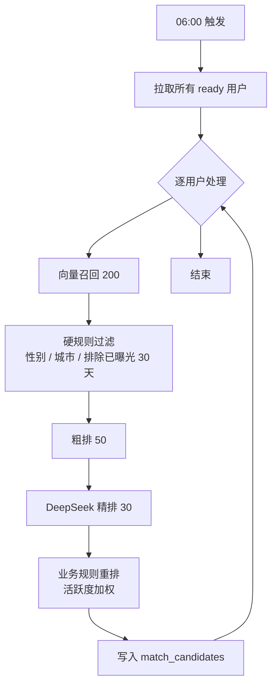
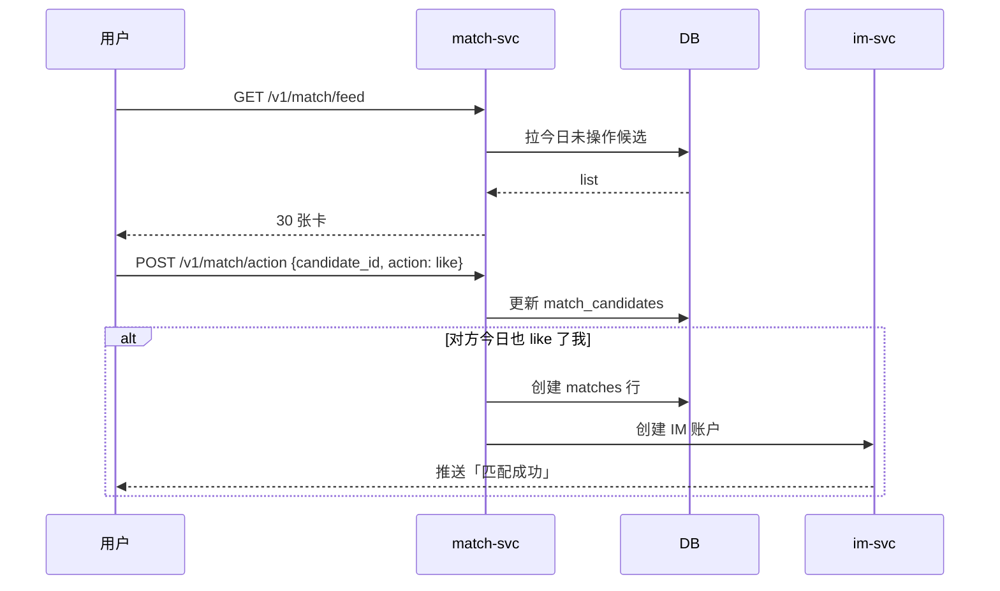

# 模块 · 匹配引擎

> 每日候选召回、排序、滑卡交互、互相喜欢触发 IM。

---

## 1. 功能范围

| 子能力 | 描述 |
|---|---|
| 每日候选召回 | 每天 06:00 为每个用户生成 top-30 候选 |
| 滑卡交互 | Tinder 式左滑跳过 / 右滑喜欢 / 上滑超级喜欢 |
| 互相喜欢触发 | 双向匹配成功 → 推送通知 + 开放 IM |
| 匹配解释 | 每个候选附带「为什么推荐你」3 条 |
| 红娘人工匹配 | 红娘在后台可手动撮合（高净值用户） |

---

## 2. 排序模型

### 双塔 + 业务规则重排

```
候选召回（向量检索） → 粗排（双塔相似度） → 精排（DeepSeek-V3 LLM 评分） → 业务规则重排
```

| 阶段 | 输入 | 输出 | 成本 |
|---|---|---|---|
| 召回 | 用户画像向量 | Top 200 | pgvector ANN（< 50ms） |
| 粗排 | 向量相似度 + 地理 | Top 50 | 纯 SQL |
| 精排 | 资料 + 价值观 | Top 30 + 解释 | DeepSeek 调用 |
| 业务规则 | 性别硬匹配 / 城市范围 / 是否已曝光 | 最终顺序 | Redis 排重 |

### 精排 prompt

```
你是严肃婚恋匹配专家。基于以下双方资料，输出：
1. 匹配度评分（0-100）
2. 3 条「为什么推荐」的简短解释（每条 15 字以内、不浮夸、不绝对化）

用户 A: {profileA}
用户 B: {profileB}

JSON 输出：{"score": int, "reasons": [string, string, string]}
```

---

## 3. 数据模型

```sql
-- 候选池（每日刷新）
match_candidates (
  user_id         BIGINT,
  candidate_id    BIGINT,
  score           REAL,
  reasons         JSONB,
  rank            INT,
  date            DATE,
  seen            BOOLEAN DEFAULT FALSE,
  action          SMALLINT,           -- 0未操作 1跳过 2喜欢 3超级喜欢
  created_at      TIMESTAMPTZ,
  PRIMARY KEY (user_id, date, candidate_id)
);

-- 匹配成功（互相喜欢）
matches (
  id              BIGSERIAL PRIMARY KEY,
  user_a          BIGINT,
  user_b          BIGINT,
  matched_at      TIMESTAMPTZ,
  status          SMALLINT,          -- 1进行中 2解除
  source          SMALLINT           -- 1自动 2红娘
);

CREATE INDEX ON matches (user_a, status);
CREATE INDEX ON matches (user_b, status);

-- 用户画像向量（pgvector）
user_vectors (
  user_id         BIGINT PRIMARY KEY,
  embedding       VECTOR(1024),      -- Qwen Embedding
  updated_at      TIMESTAMPTZ
);
```

---

## 4. 关键流程

### 每日候选生成（CronJob 06:00）



> 单次精排 ≈ ¥0.005 × 30 = ¥0.15/人。DAU 1 万每日 ¥1,500 精排成本 → 实际通过 LLM 抽样 50%，其余用粗排+规则。

### 滑卡交互



---

## 5. API 契约

```typescript
// GET /v1/match/feed?cursor=xxx
→ {
  candidates: Array<{
    userId: number,
    nickname: string,
    avatar: string,
    age: number,
    city: string,
    job: string,
    score: number,
    reasons: string[],
    topTags: string[]
  }>,
  nextCursor: string | null
}

// POST /v1/match/action
{ candidateId: number, action: 'skip' | 'like' | 'super' }
→ { matched: boolean, matchId?: number, roomId?: string }

// GET /v1/match/list   我的双向匹配列表
→ { matches: Array<MatchDTO> }
```

---

## 6. 反作弊与质量

| 风险 | 措施 |
|---|---|
| 集中右滑（刷量） | 单日 like 上限 50，超出转 skip |
| 资料造假 | 职业 / 学历二次抽样核验（高价值用户） |
| 同 IP 多账号 | 风控规则：同 IP 注册 > 3 个拒绝新注册 |
| LLM 解释雷同 | 解释文本去重 + 人工抽查 |
| 地域歧视 | 解释中禁止出现「外地人」「农村」等词 |

---

## 7. 降级与边界

| 场景 | 处理 |
|---|---|
| LLM 精排全挂 | 退回到粗排 top 30 + 固定话术模板 |
| pgvector ANN 超时 | 切到暴力扫描（pgvector 支持 SET ivfflat.probes=10） |
| 候选不足 30 | 用 Redis 中的「同城热门」兜底补足，明确标注「热门推荐」 |
| 匹配成功但 IM 账户创建失败 | 状态机：pending_im，每 30s 重试到成功为止 |