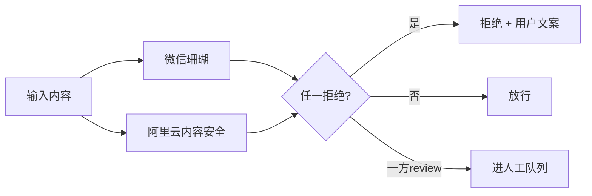
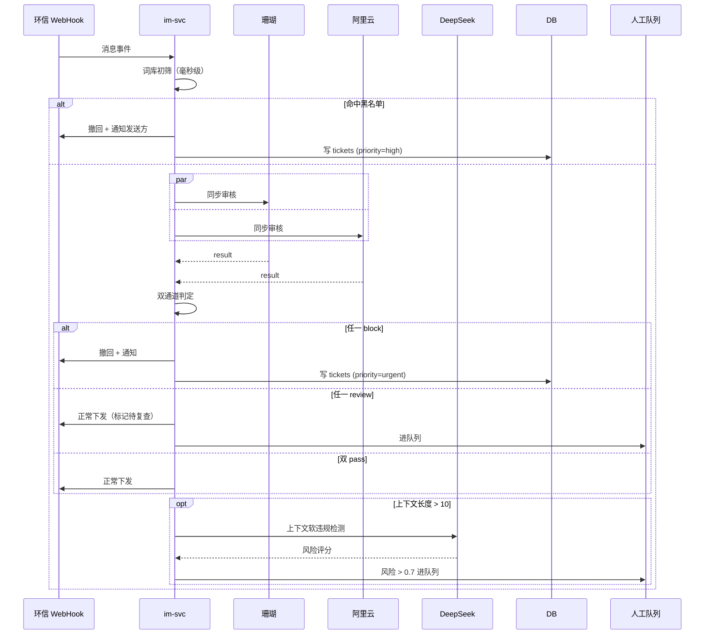
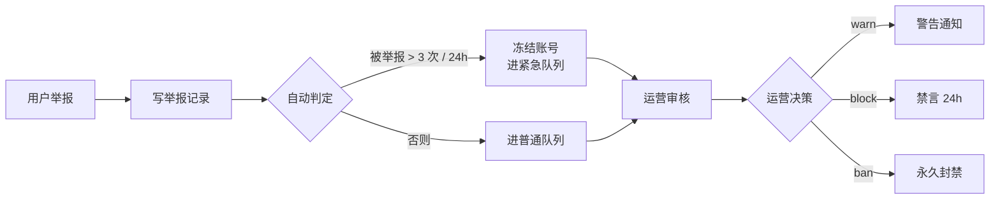

# 模块 · 内容审核

> 双通道机器审核 + 人工审核，覆盖用户资料、IM 消息、AI 红娘/分身输出。

---

## 1. 审核范围

| 场景 | 触发点 | 同步/异步 |
|---|---|---|
| 用户资料 | 注册 / 资料更新 | 同步 |
| 用户头像 | 上传时 | 同步 |
| IM 文本消息 | 发送时（WebHook） | 同步（弱一致） |
| IM 图片消息 | 发送时 | 同步 |
| AI 红娘输出 | LLM 流式输出末段 | 同步 |
| AI 分身输出 | LLM 输出后 | 同步 |
| 用户头像相册批量扫描 | 每日 Cron | 异步 |

---

## 2. 三道审核闸

### 闸 1：机器审核（双通道）



| 维度 | 微信珊瑚 | 阿里云 |
|---|---|---|
| 文本 | ✅ | ✅ |
| 图片 | ✅ | ✅ |
| 音频 | ✅（ASR + 文本审核） | ❌ |
| 视频 | ✅ | ❌ |
| 政策库 | 微信生态库 | 阿里通用库 + 监管库 |
| 兜底 | 主通道 | 主通道挂时启用 |

### 闸 2：AI 上下文审核

> 仅对 IM 长消息启用——把最近 10 条消息打包送 LLM，判断「整体是否存在软色情 / 骚扰 / 引战」。

```
单条珊瑚 pass ≠ 上下文安全
例：「我一个人住」→「有点寂寞」→「可以来我家吗」珊瑚逐条全过，但上下文是骚扰。
```

### 闸 3：人工审核

- 审核队列按严重程度分级：紧急（涉政 / 涉毒）> 高（涉黄 / 涉暴）> 中（引战 / 广告）> 低（其他）
- 运营 SLA：紧急 5 分钟、高 30 分钟、中 2 小时、低 24 小时
- 审核结果四档：pass / warn / block / ban

---

## 3. 敏感词与黑名单

```sql
-- 词库（多版本，支持热更新）
sensitive_words (
  id              SERIAL PRIMARY KEY,
  word            TEXT,
  category        TEXT,           -- porn / political / violence / scam / ad
  severity        SMALLINT,       -- 1block 2review 3warn
  version         INT,
  created_at      TIMESTAMPTZ
);

-- 黑名单（设备 / IP / 手机号）
risk_lists (
  type            SMALLINT,       -- 1device 2ip 3phone 4id_card
  value           TEXT,
  reason          TEXT,
  added_by        BIGINT,
  expires_at      TIMESTAMPTZ
);
```

> 词库通过 CDN JSON 热更新，应用启动时拉取最新版本。

---

## 4. 数据模型

```sql
-- 审核工单
moderation_tickets (
  id              BIGSERIAL PRIMARY KEY,
  source          SMALLINT,        -- 1profile 2msg 3avatar 4ai_out
  target_id       BIGINT,          -- 关联的资源 ID
  user_id         BIGINT,          -- 内容生产者
  content_hash    TEXT,            -- 内容哈希，便于去重
  content_snapshot TEXT,           -- 原始内容存档（30 天）
  priority        SMALLINT,
  status          SMALLINT,        -- 1pending 2reviewing 3done
  machine_result  JSONB,           -- 珊瑚 + 阿里云原始返回
  human_result    SMALLINT,        -- 1pass 2warn 3block 4ban
  human_notes     TEXT,
  reviewer_id     BIGINT,
  created_at      TIMESTAMPTZ,
  handled_at      TIMESTAMPTZ
);

-- 处罚记录
punishments (
  id              BIGSERIAL PRIMARY KEY,
  user_id         BIGINT,
  type            SMALLINT,        -- 1warn 2mute 3ban_24h 4ban_perm
  reason          TEXT,
  ticket_id       BIGINT,
  created_at      TIMESTAMPTZ,
  expires_at      TIMESTAMPTZ
);
```

---

## 5. 关键流程

### IM 消息审核流水线



### 用户举报



---

## 6. API 契约

```typescript
// POST /v1/mod/text
{ text: string, context?: Array<{role, content}> }
→ { decision: 'pass' | 'review' | 'block', providers: {...} }

// POST /v1/mod/image
{ url: string }
→ { decision, scenes: string[] }   // scenes: ['porn', 'politics', ...]

// POST /v1/mod/voice
{ url: string }
→ { asrText: string, decision, ... }

// GET /v1/admin/mod/queue?priority=&status=
→ { tickets: Array<TicketDTO> }

// POST /v1/admin/mod/ticket/:id/decide
{ decision: 'pass' | 'warn' | 'block' | 'ban', notes?: string }
```

---

## 7. 申诉流

- 用户被处罚后 7 天内可申诉一次
- 申诉进入「申诉队列」，由资深运营 24h 内处理
- 申诉通过 → 撤销处罚 + 补偿（如被禁言期间权益顺延）

---

## 8. 降级与边界

| 场景 | 处理 |
|---|---|
| 珊瑚 API 超时 | 立即降级到阿里云单通道 |
| 双通道全挂 | 切到**只允许白名单词**模式（欢迎/你好/很高兴认识你等 50 个），其他进队列暂存 |
| LLM 上下文审核挂 | 跳过这一步，仅靠单条审核 |
| 审核队列堆积 > 500 | 自动降级：仅紧急和高优先级入队，中低优先级延后 |
| 紧急工单超 SLA | 飞书告警 + 自动升级到 Owner 手机 |

---

## 9. 监管要求（婚恋类目特有）

- 用户实名信息**单独加密存储**（与常规资料分表），仅 Owner + 审核主管可访问
- 保留 180 天消息存档，监管可查
- 重大案件（涉政 / 涉毒 / 涉暴）需**立即上报当地网安部门**，预留紧急上报通道
- 算法备案：AI 红娘 / 分身 / 军师 都需「生成式人工智能服务备案」+「深度合成服务备案」