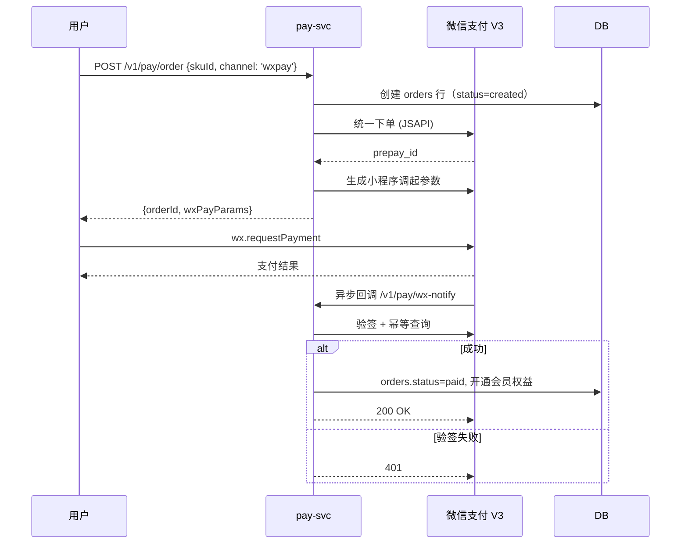
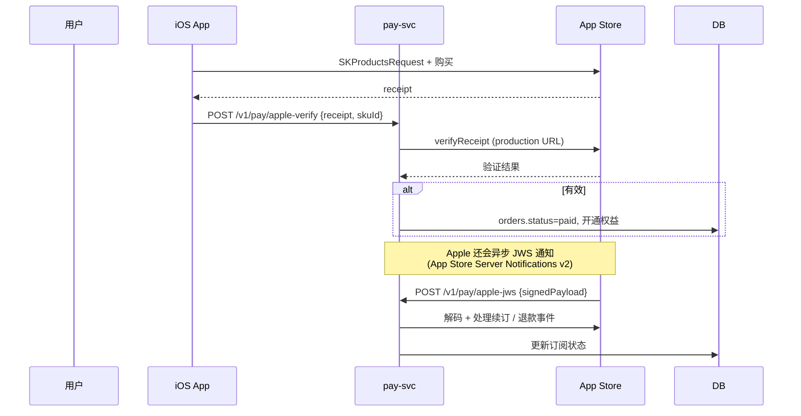
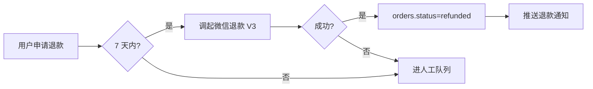
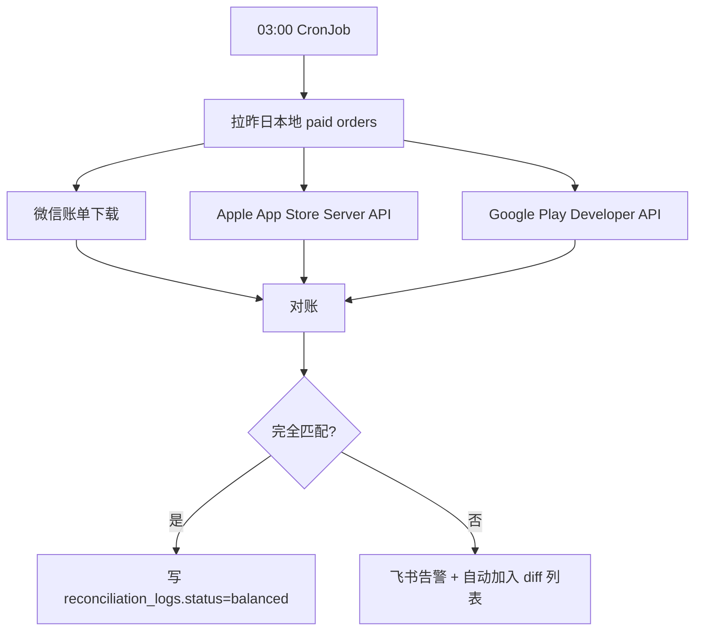

# 模块 · 支付与会员

> 微信支付 V3（小程序）+ Apple IAP（iOS）+ Google Play Billing（Android）。

---

## 1. 功能范围

| 子能力 | 描述 |
|---|---|
| 会员订阅 | 月度 / 季度 / 年度三档 |
| 单项服务 | AI 红娘包月、AI 军师单次解锁 |
| 退款 | 7 天内自动退款（合规底线） |
| 发票 | 用户主动申请，开票接口对接 |
| 优惠券 | 新人券 / 节日券 / 邀请券 |
| 对账 | 每日 03:00 自动跑批对账 |

---

## 2. 套餐设计

| 套餐 | 价格（小程序） | 价格（App） | 权益 |
|---|---|---|---|
| 体验 7 天 | ¥9.9 | ¥9.9 | 10 次 AI 红娘 / 5 次 AI 分身 |
| 月度会员 | ¥68 | ¥78 | 不限 AI 红娘 / 30 次 AI 分身 / 优先匹配 |
| 季度会员 | ¥188 | ¥218 | 同月度 ×3 + 1 次人工红娘 |
| 年度会员 | ¥688 | ¥798 | 同月度 ×12 + 4 次人工红娘 + 线下活动优先 |
| AI 军师单次 | ¥19.9 | ¥19.9 | 单次关系诊断 |
| 人工红娘 1v1 | ¥299 | ¥299 | 60 分钟通话 + 报告 |

> **App 端定价高于小程序 10~15%** 以摊薄 Apple / Google 抽成。

---

## 3. 关键流程

### 微信支付（小程序）



### Apple IAP



### 退款流程



---

## 4. 数据模型

```sql
-- 订单
orders (
  id              BIGSERIAL PRIMARY KEY,
  user_id         BIGINT,
  sku_id          TEXT,
  amount_cents    INT,
  currency        TEXT DEFAULT 'CNY',
  channel         SMALLINT,           -- 1wxpay 2apple 3google
  channel_order_id TEXT,
  status          SMALLINT,           -- 0created 1paid 2refunded 3closed 4failed
  paid_at         TIMESTAMPTZ,
  refunded_at     TIMESTAMPTZ,
  created_at      TIMESTAMPTZ
);

-- 订阅
subscriptions (
  id              BIGSERIAL PRIMARY KEY,
  user_id         BIGINT,
  sku_id          TEXT,
  channel         SMALLINT,
  status          SMALLINT,           -- 1active 2expired 3canceled
  starts_at       TIMESTAMPTZ,
  expires_at      TIMESTAMPTZ,
  auto_renew      BOOLEAN DEFAULT TRUE,
  channel_sub_id  TEXT,               -- Apple original_transaction_id 等
  created_at      TIMESTAMPTZ
);

-- 对账日志
reconciliation_logs (
  date            DATE,
  channel         SMALLINT,
  local_count     INT,
  local_amount    BIGINT,
  remote_count    INT,
  remote_amount   BIGINT,
  diff_count      INT,
  diff_amount     BIGINT,
  status          SMALLINT,           -- 1balanced 2investigating
  ran_at          TIMESTAMPTZ
);

-- 优惠券
coupons (
  code            TEXT PRIMARY KEY,
  amount_cents    INT,
  expires_at      TIMESTAMPTZ,
  used_by         BIGINT,
  used_at         TIMESTAMPTZ
);
```

---

## 5. 对账机制

每日 03:00 自动跑批：



---

## 6. API 契约

```typescript
// GET /v1/pay/skus
→ { skus: Array<{skuId, name, priceCents, channel}> }

// POST /v1/pay/order
{ skuId, channel: 'wxpay' | 'apple' | 'google', couponCode?: string }
→ { orderId, wxPayParams?, appleProductId?, googleProductId? }

// POST /v1/pay/wx-notify    （微信回调，验签）
{ resource: { ciphertext, associated_data, nonce } }
→ { code: 'SUCCESS' | 'FAIL' }

// POST /v1/pay/apple-jws    （Apple JWS v2）
{ signedPayload: string }
→ { code: 0 }

// GET /v1/pay/me/subscription
→ { active: boolean, expiresAt?: string, autoRenew: boolean }
```

---

## 7. 关键坑点（踩过的）

1. **Apple IAP 必须先 verifyReceipt 再发货** —— 客户端 `receipt` 可能伪造
2. **微信回调必须回 200 OK** —— 否则微信 5 分钟内重试 4 次，但同时你要幂等
3. **续订状态只有 Apple 主动通知** —— 不要靠客户端轮询，会被风控
4. **Google Play 退款不会主动通知** —— 订阅过期是唯一信号，需要主动 `purchases.subscriptionsv2.get`
5. **小程序虚拟支付类目** —— 婚恋类属于「生活服务 > 婚恋服务」，需提前准备好 ICP 备案号
6. **金额用分（cents）** —— 永远不要用浮点

---

## 8. 降级与边界

| 场景 | 处理 |
|---|---|
| 微信下单失败 | 用户可切到「H5 支付」（需提前申请 H5 域名） |
| Apple 验证服务器挂 | 重试 3 次；仍失败则暂时挂起，等用户重连时再验证 |
| 对账 diff | 自动进人工队列 + 飞书告警，**不**自动退款 |
| 用户多次申请退款 | 风控：拒绝 + 进审核 |