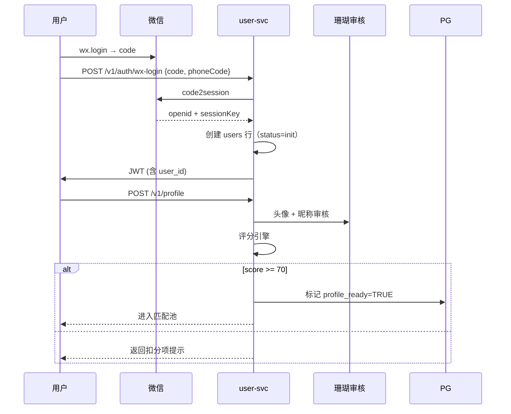

# 模块 · 用户与资料

> 用户注册、实名认证、资料完善、评分门槛、画像标签。

---

## 1. 功能范围

| 子能力 | 描述 |
|---|---|
| 微信一键登录 | 小程序 `wx.login` 拿 code → 后端 `code2session` 拿 openid/unionid |
| 手机号绑定 | 强制绑定，作为安全兜底（账号找回 / 风险核验） |
| 实名认证 | 公安部二要素 + 活体检测（腾讯云慧眼） |
| 资料完善 | 28 维画像：基础 6 项 + 婚恋 12 项 + 价值观 10 项 |
| 资料评分 | 0–100 阈值 ≥ 70 才能进入匹配池 |
| 标签系统 | 自动标签（AI 提取）+ 用户自选标签 |
| 头像 / 相册 | COS 存储 + 微信珊瑚审核 |

---

## 2. 数据模型

```sql
-- 主表
users (
  id              BIGSERIAL PRIMARY KEY,
  openid          TEXT UNIQUE NOT NULL,
  unionid         TEXT,
  phone           TEXT UNIQUE,
  nickname        TEXT NOT NULL,
  avatar_url      TEXT,
  gender          SMALLINT,        -- 1男 2女
  birth_date      DATE,
  city            TEXT,
  real_name_verified BOOLEAN DEFAULT FALSE,
  profile_score   SMALLINT DEFAULT 0,
  status          SMALLINT DEFAULT 1,  -- 1正常 2禁言 3封禁
  created_at      TIMESTAMPTZ DEFAULT NOW(),
  updated_at      TIMESTAMPTZ DEFAULT NOW()
);

-- 资料详情（按需加载）
profiles (
  user_id         BIGINT PRIMARY KEY REFERENCES users(id),
  height          SMALLINT,
  education       TEXT,
  occupation      TEXT,
  income_range    TEXT,
  marriage_status TEXT,           -- 未婚/离异/丧偶
  has_child       BOOLEAN,
  want_child      BOOLEAN,
  partner_criteria JSONB,        -- 理想伴侣画像
  lifestyle       JSONB,          -- 作息/饮食/运动/烟酒
  values          JSONB,          -- 价值观 10 题
  raw_answers     JSONB           -- 完整问卷原文
);

-- 标签（多对多）
tags (
  id              SERIAL PRIMARY KEY,
  name            TEXT UNIQUE,
  category        TEXT,           -- lifestyle / value / hobby
  source          SMALLINT        -- 1用户自选 2AI提取
);

user_tags (
  user_id         BIGINT,
  tag_id          INT,
  confidence      REAL,           -- AI 提取置信度
  PRIMARY KEY (user_id, tag_id)
);

-- 实名记录（敏感，独立表 + 行级权限）
id_verifications (
  user_id         BIGINT PRIMARY KEY REFERENCES users(id),
  real_name       TEXT,           -- 加密存储
  id_card_hash    TEXT,           -- 哈希索引，便于比对
  verified_at     TIMESTAMPTZ,
  expire_at       TIMESTAMPTZ
);
```

---

## 3. 资料评分模型

| 维度 | 权重 | 评分要点 |
|---|---|---|
| 基础完整度 | 20% | 头像、昵称、城市、生日 |
| 婚恋诚意 | 25% | 必填 12 项是否填写 |
| 价值观深度 | 30% | 价值观 10 题文本长度 + AI 评估「真诚度」 |
| 实名认证 | 15% | 二要素 + 活体 |
| 头像合规度 | 10% | 是否真人正脸（非风景/卡通） |

**AI 评估价值观真诚度** 调用 DeepSeek-V3 Few-shot 评分，prompt：

```
你是婚恋资料审核员。给定用户填写的价值观 10 题文本，从"真诚、具体、可信"三个维度打 0-100。
若文本明显敷衍（< 5 字/题，全选"都行"），直接打 0 分。
```

---

## 4. 关键流程

### 注册 → 匹配池准入



### 资料更新时的缓存策略

- 资料详情 → Redis 缓存 30 分钟，键 `profile:{user_id}`
- 标签 / 评分 → 缓存 5 分钟，键 `score:{user_id}`
- 任何写操作 → 失效相关键 + 发 `profile.updated` 事件到 BullMQ

---

## 5. API 契约

```typescript
// POST /v1/auth/wx-login
{ code: string, phoneCode?: string }
→ { token: string, user: UserDTO, isNew: boolean }

// POST /v1/profile
{ profile: ProfileDTO, tags: string[] }
→ { score: number, blockers: string[] }

// GET /v1/me
→ { user, profile, tags, score, canMatch: boolean }

// POST /v1/id-verification  (调用慧眼活体)
{ realName: string, idCard: string, faceImg: string }
→ { verified: boolean, reason?: string }
```

---

## 6. 降级与边界

| 场景 | 处理 |
|---|---|
| 微信 code2session 超时 | 重试 3 次，仍失败 → 报错让用户重试 |
| 慧眼活体服务挂 | 切换到「人工审核通道」，用户上传手持身份证 |
| AI 评分服务挂 | 退回到纯规则评分（除价值观那 30 分外） |
| 用户资料涉敏感 | 立即冻结 + 进审核队列，**不**自动通过 |

---

## 7. 一人开发的特殊考量

- **单点登录**：JWT 12h 有效期，无 refresh token；前端每次进入调 `GET /v1/me` 拉最新资料
- **删除用户**：软删除（status=4），30 天后定时任务硬删，并匿名化聊天记录
- **隐私导出**：用户随时可申请下载自己全部数据（GDPR / 个保法要求），打包成 zip 放 COS 临时链接