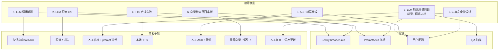

# Runbook · AI 服务稳定性排查预案

> AI 是良配差异化能力的核心，也是最大的不确定性来源。本文档列出 7 类典型故障 + 排查 + 兜底。

---

## 1. AI 故障全景图



---

## 2. 故障 1 · LLM 调用超时

### 症状

- AI 红娘首响 P95 > 4s
- Sentry 大量 `LLMTimeoutError`

### 排查步骤

```bash
# 1. 看是哪个供应商慢
curl -s 'http://prom.liangpei.app/api/v1/query?query=histogram_quantile(0.95,rate(llm_request_duration_seconds_bucket[5m]))' | jq .

# 2. 看错误率
curl -s 'http://prom.liangpei.app/api/v1/query?query=rate(llm_errors_total[5m])' | jq .

# 3. 单点探测
curl -X POST https://api.deepseek.com/v1/chat/completions \
  -H "Authorization: Bearer $DS_KEY" \
  -d '{"model":"deepseek-chat","messages":[{"role":"user","content":"hi"}],"max_tokens":10}'
```

### 兜底

```typescript
// llm-router 自动 fallback
if (elapsed > 4000) {
  throw new SwitchProviderError();
}
```

### 长期改进

- 监控每个供应商的 P95，超阈值 5 分钟自动切主供应商
- 给慢请求加 4s 超时，不要等 30s

---

## 3. 故障 2 · LLM 限流（429）

### 症状

- AI 接口集中报 `LLMRateLimitError`
- Sentry 抓到的 429 比例 > 5%

### 排查

```bash
# 看是否打到限流阈值
grep -r "429" /var/log/cls/ai-svc/ | tail -20

# 看每个供应商配额
curl -s "https://api.deepseek.com/v1/usage" -H "Authorization: Bearer $DS_KEY"
```

### 兜底

1. 立即切到备用供应商（豆包 → Qwen）
2. 启动请求队列（Redis BullMQ），限速 100 QPS
3. 降级：非核心场景（AI 军师）返回"系统繁忙，请稍后再试"

---

## 4. 故障 3 · LLM 输出质量问题（幻觉 / 偏离人格）

### 症状

- AI 红娘开始用"亲～"、"宝贝儿"称呼用户
- AI 红娘替用户做决定（"你应该跟他在一起"）
- AI 分身回答明显不符合本人风格
- 用户反馈"机器人味太重"

### 排查

```bash
# 抽样最近 100 轮对话
psql -c "
SELECT id, content FROM ai_messages
WHERE created_at > NOW() - INTERVAL '1 day'
ORDER BY random() LIMIT 100;" > /tmp/sample.txt

# 用另一个 LLM 评估
cat /tmp/sample.txt | claude-code "评估这些 AI 回复是否有人设偏离、幻觉、夸大"
```

### 兜底

1. 临时收紧 temperature（0.7 → 0.3）
2. 加强 system prompt 中的"绝对禁止"条款
3. 增加"我不知道"类兜底话术的概率

### 长期改进

- 每周跑一次自动化人格评估（10 个固定 probe）
- 维护人格红/黄/绿样本集，任何 prompt 改动必须 100% 绿通过

---

## 5. 故障 4 · TTS 合成失败

### 症状

- 用户能说话，但听不到 AI 回复
- Sentry 报 `TTSUpstreamError`

### 排查

```bash
# 测豆包 Realtime
curl -X POST "https://openspeech.bytedance.com/api/v1/tts" \
  -H "Authorization: Bearer $DW_KEY" \
  -d '{"text":"测试","voice":"zh_female_shuangkuai"}' \
  --output /tmp/test.mp3
file /tmp/test.mp3   # 应为 MP3
```

### 兜底

```typescript
if (ttsProvider === 'doubao' && ttsFailed) {
  // 切到本地 edge-tts（轻量 fallback）
  return await localTTS(text);
}
```

---

## 6. 故障 5 · ASR 转写错误

### 症状

- 用户说"我叫张三"，AI 红娘回应"您叫李四是吧？"
- 转写延迟 > 1s

### 排查

```bash
# 看 Whisper 服务状态
systemctl status whisper-server
ps aux | grep faster-whisper | grep -v grep

# 看队列堆积
psql -c "SELECT COUNT(*) FROM asr_tasks WHERE status = 1 AND created_at < NOW() - INTERVAL '10 seconds';"
```

### 兜底

1. **用户重说提示**："不好意思没听清，能再说一次吗？"
2. 切换到云端 ASR（豆包 ASR / 腾讯云 ASR）作为备用
3. 极端情况：让用户改用文字输入

---

## 7. 故障 6 · 向量检索召回率低

### 症状

- 匹配候选明显不符合预期（用户 A 在北京，推荐了 10 个广东的）
- pgvector 召回耗时 > 200ms

### 排查

```sql
-- 看向量覆盖率
SELECT COUNT(*) FILTER (WHERE embedding IS NOT NULL) * 1.0 / COUNT(*) 
FROM user_vectors;

-- 看索引是否重建
SELECT * FROM pg_stat_user_indexes WHERE indexname LIKE '%user_vectors%';

-- 看实际召回
EXPLAIN ANALYZE
SELECT user_id FROM user_vectors
ORDER BY embedding <=> (SELECT embedding FROM user_vectors WHERE user_id = 12345)
LIMIT 30;
```

### 兜底

1. **临时切到暴力扫描**：`SET ivfflat.probes = 10;`
2. **临时降低向量权重**，纯 SQL 规则排序
3. 若新用户无向量，用城市 + 婚恋状态硬匹配兜底

---

## 8. 故障 7 · 内容安全误杀

### 症状

- 用户正常聊天被撤回（如"我一个人住"被拦）
- 审核队列中有大量明显误判

### 排查

```bash
# 1. 抽样最近 24h 被 block 的消息
psql -c "
SELECT content, audit_provider, machine_result
FROM im_messages
WHERE audit_status = 3
AND sent_at > NOW() - INTERVAL '24 hours'
ORDER BY sent_at DESC LIMIT 50;"

# 2. 看珊瑚和阿里云误判率
psql -c "
SELECT audit_provider, 
       COUNT(*) FILTER (WHERE audit_status = 3) AS blocked,
       COUNT(*) FILTER (WHERE audit_status = 2) AS review,
       COUNT(*) AS total
FROM im_messages
WHERE sent_at > NOW() - INTERVAL '24 hours'
GROUP BY audit_provider;"
```

### 兜底

1. 临时把疑似误判的词加入白名单（人工 review 后）
2. 调高 review 阈值（更宽容，全部进人工复审）
3. 通知运营手动复核最近 100 条 block

### 长期改进

- 维护误判样本库，提交给珊瑚 / 阿里云（百度云也支持）
- 自建「上下文软违规」模型（ADR-002 中提到）

---

## 9. 通用 AI 监控指标

| 指标 | 阈值 | 数据源 |
|---|---|---|
| AI 红娘首响 P95 | < 2s | Prometheus |
| AI 红娘成功率 | > 99% | Prometheus |
| AI 红娘兜底率 | < 5% | Prometheus |
| AI 红娘平均轮次 | 8-15 | Postgres |
| 用户举报 AI 回复 | < 1% / 千轮 | 举报表 |
| AI 输出珊瑚通过率 | > 95% | mod-svc |
| 多供应商 fallback 触发率 | < 10% | Sentry |

---

## 10. AI 故障演练（每月一次）

| 演练 | 怎么做 | 通过标准 |
|---|---|---|
| DeepSeek 全挂 | 在网关层 mock 502 | 30s 内切到豆包，对用户无感 |
| 豆包 Realtime 全挂 | 改 TTS provider | 5s 内本地 TTS 接上 |
| ASR 服务挂 | 改 Whisper provider | 用户切到文字输入 |
| LLM 注入成功 | 注入 10 个对抗 prompt | 0/10 绕过 |

> 演练结果写进 `runbook/drills/` 目录，月度复盘。