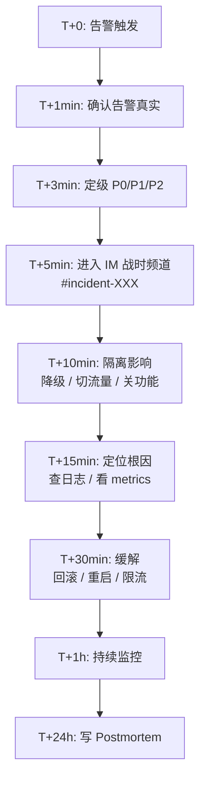

# Runbook · 故障响应剧本

> 一人开发 = 一人响应。必须**事前**把响应流程写死，事中才能快速执行。

---

## 1. 故障分级

| 级别 | 定义 | 响应时间 | 通知 |
|---|---|---|---|
| **P0** | 全站不可用 / 数据丢失 / 资金风险 | 立即（< 5min） | 电话 + 短信 + 飞书 |
| **P1** | 核心功能不可用（匹配 / IM / 支付） | < 15min | 飞书 + 短信 |
| **P2** | 非核心功能降级（AI / 后台） | < 1h | 飞书 |
| **P3** | 体验问题 / 小 bug | < 24h | 飞书（无 oncall） |

---

## 2. 通用响应流程（黄金 30 分钟）



---

## 3. P0 剧本（精选 3 个高概率场景）

### 3.1 数据库主库宕机

**触发**：PG 连接失败 > 30s / Sentry 异常暴增

**响应**：

```bash
# 1. 确认主库状态
ssh app-server-1 "pg_isready -h pg-primary -p 5432"

# 2. 检查 Patroni 状态
ssh pg-primary "patronictl list"

# 3. 若 Patroni 已自动 failover，验证备库已升主
ssh pg-standby "pg_isready -h localhost -p 5432"

# 4. 修改应用配置（指向新主库）
ssh app-server-1 "pm2 reload api"

# 5. 验证恢复
curl -I https://api.liangpei.app/health
```

**回滚**：若自动 failover 失败，手动 `patronictl failover --candidate pg-standby`

---

### 3.2 环信 IM 全集群故障

**触发**：用户报"消息发不出去" / WebHook 全部 5xx

**响应**：

```bash
# 1. 看环信控制台状态
open https://console.easemob.com/status

# 2. 启 fallback：消息暂存到 PG
pm2 env api "IM_PROVIDER=local"
pm2 reload api

# 3. 推送通知用户"网络波动"
curl -X POST https://api.liangpei.app/v1/announcement/push \
  -H 'Content-Type: application/json' \
  -d '{"text":"消息功能维护中，请稍候重试","scope":"all"}'

# 4. 持续监控
watch -n 30 "curl -s https://api.liangpei.app/health/im"
```

**恢复条件**：环信官方公告恢复 + 自测 10 条消息正常 → 切回 `IM_PROVIDER=easemob`

---

### 3.3 微信支付回调失败

**触发**：对账 diff > 0 / 用户报"付了款但没到账"

**响应**：

```bash
# 1. 立即查未入账订单
psql -h pg-primary -d liangpei -c "
SELECT id, user_id, amount_cents, channel_order_id, status, created_at
FROM orders
WHERE status = 0 AND created_at > NOW() - INTERVAL '1 hour'
ORDER BY created_at DESC;"

# 2. 对每笔订单查微信订单状态
for order_id in $(...); do
  curl "https://api.liangpei.app/v1/admin/pay/wx-query/$order_id" \
    -H "Authorization: Bearer $OWNER_TOKEN"
done

# 3. 若是用户已付但本地未入账：
#    手工调入账接口
curl -X POST "https://api.liangpei.app/v1/admin/pay/force-paid/$order_id" \
  -H "Authorization: Bearer $OWNER_TOKEN"
```

**禁止**：在未确认用户已付款的情况下手动开通权益——有薅羊毛风险。

---

## 4. P1 剧本（精选 3 个）

### 4.1 DeepSeek-V3 全挂

**症状**：AI 红娘 / 分身 / 军师统一报 500
**响应**：自动触发 llm-router fallback 到豆包 Pro，无需人工

```bash
# 验证 fallback 生效
curl -X POST https://api.liangpei.app/v1/ai/hongniang/test \
  -H "Authorization: Bearer $TEST_TOKEN" \
  -d '{"text":"你好"}'

# 看 Sentry 是否还在大量报 DeepSeek 错
# 若 5 分钟内仍 80%+ 错误，则全部降级到兜底话术
pm2 env api "AI_MODE=fallback_only"
pm2 reload api
```

---

### 4.2 审核队列堆积

**症状**：moderation_tickets pending > 500
**响应**：

```bash
# 1. 自动降级已在代码中（仅紧急 + 高入队）
# 2. 紧急情况：手动关闭低优先级分桶
psql -c "UPDATE moderation_tickets SET status = 6 
         WHERE priority = 4 AND status = 1 
         AND created_at < NOW() - INTERVAL '2 hours';"

# 3. 飞书公告 Owner
```

---

### 4.3 匹配池生成失败

**症状**：用户进入匹配页空白
**响应**：

```bash
# 1. 手动跑一次候选生成
psql -c "SELECT generate_daily_candidates(NOW());"

# 2. 若 SQL 报错，看具体错误（通常是索引问题或 LLM 限流）
# 3. 应急：直接复制昨日候选池
psql -c "
INSERT INTO match_candidates (user_id, candidate_id, score, reasons, rank, date)
SELECT user_id, candidate_id, score, reasons, rank, CURRENT_DATE
FROM match_candidates
WHERE date = CURRENT_DATE - 1
ON CONFLICT DO NOTHING;"
```

---

## 5. 沟通模板

### 用户公告（小程度）

```
【良配】亲爱的用户，{{时间}}起我们发现{{功能}}异常，
工程师正在紧急处理，预计 {{时长}} 恢复。
给您带来不便深表歉意。
```

### 用户公告（重大）

```
【良配】重要通知：{{时间}}，我们发现 {{影响范围}}。
已暂停 {{功能}}，正在紧急修复，预计 {{时长}} 恢复。
期间您的 {{权益}} 已自动顺延。客服微信：xxx
```

### 内部战时频道

```
#incident-2026-08-14-im-down

T+0  IM 全面 5xx
T+5  已隔离，启 local fallback
T+10 环信确认 BGP 故障，预计 30min 恢复
T+30 已恢复，切回 easemob
```

---

## 6. Postmortem 模板（24h 内完成）

```markdown
# Postmortem · {{标题}}

## TL;DR
- 故障时间：{{start}} → {{end}}（共 {{duration}}）
- 影响：{{user_count}} 用户，{{revenue_impact}}
- 根因：{{root_cause_one_line}}
- 缓解耗时：{{mitigation_time}}

## 时间线
- T+0 ...
- T+5 ...

## 根因分析（5 Why）
1. 为什么...
2. 为什么...

## 影响
- 用户影响
- 业务影响（订单、退款、流失）

## 解决过程

## 后续行动项
- [ ] Owner: @name  截止: 2026-08-21  描述: ...
- [ ] Owner: @name  截止: 2026-08-28  描述: ...

## 教训
- ...
```

---

## 7. 一人开发的特殊约束

1. **永远不要在半夜做大改动**——出问题时没人兜底
2. **每个新功能上线必须先灰度 1%**——能提前发现问题
3. **关键路径必须有降级开关**——单一供应商挂掉不能拖垮全站
4. **手机永远开启 P0 告警推送**——别指望"明天再说"
5. **重大变更前通知所有种子用户**——出问题时他们愿意帮你测